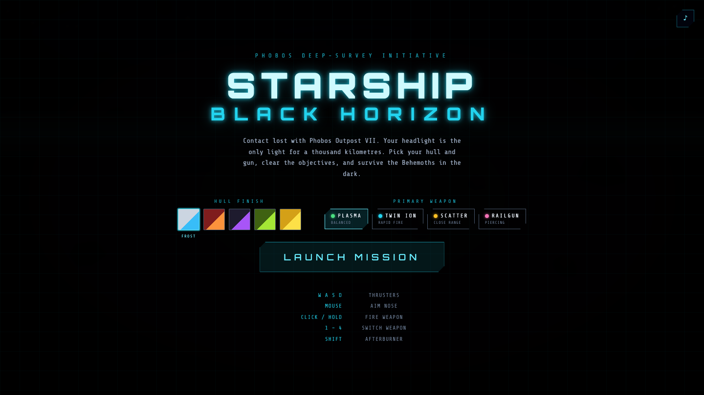
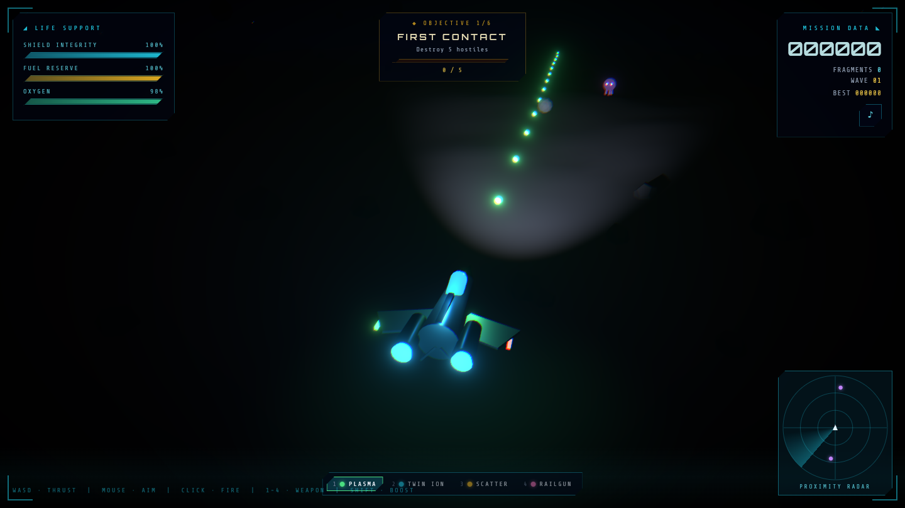
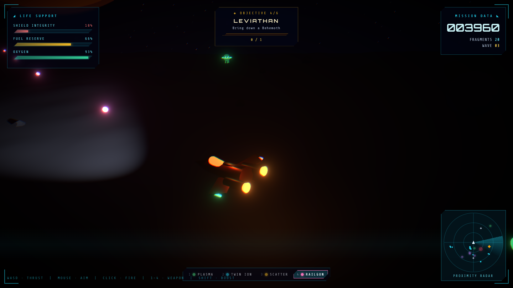
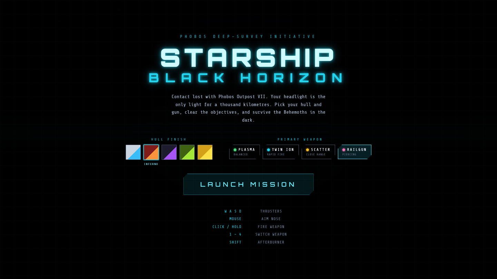
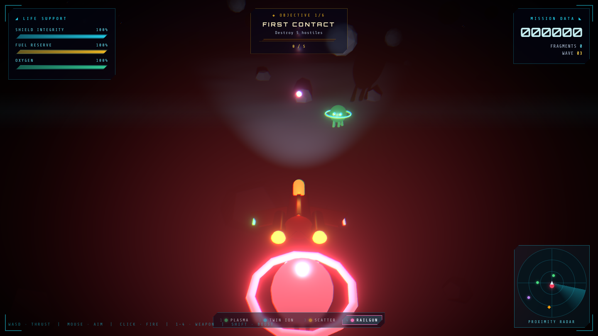
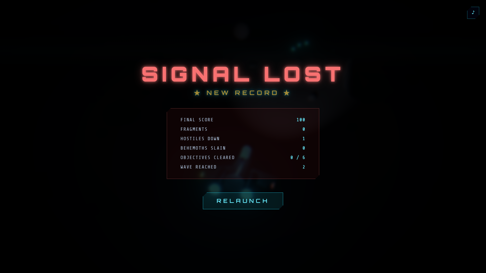
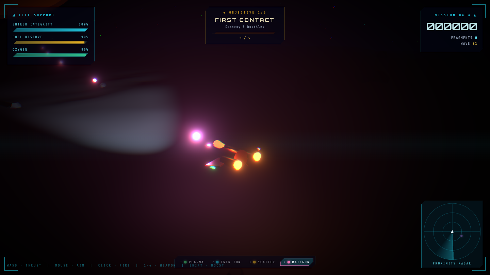

# Starship: Black Horizon

A 3D survival shooter set on the pitch-black surface of Phobos, Mars's inner moon. Your ship's headlight is the only light source — alien signatures hunt you through the dark while you harvest star fragments to keep your oxygen and fuel alive.



---

## Tech Stack

| Layer | Library |
|---|---|
| Framework | Next.js 14 (App Router) |
| 3D Rendering | React Three Fiber + Three.js |
| Helpers / Shaders | @react-three/drei |
| Post-processing | @react-three/postprocessing |
| State | Zustand |
| Styling | Tailwind CSS |
| Audio | Web Audio API (zero asset files — all SFX synthesized at runtime) |

---

## Screenshots

| | |
|---|---|
|  |  |
|  |  |
|  |  |

---

## Getting Started

```bash
npm install
npm run dev        # http://localhost:3000
```

Production build:

```bash
npm run build
npm start
```

---

## Controls

| Input | Action |
|---|---|
| `W A S D` | Thrusters (world-space axes, twin-stick layout) |
| Mouse | Aim the ship's nose |
| Left Click / Hold | Fire plasma cannon |
| `Shift` | Afterburner — faster, but burns fuel quickly |

---

## Game Systems

### Enemies
- **Stalkers** (purple) — 2 HP, tentacled, deal heavy damage on contact
- **Drones** (green) — 1 HP, fast, surrounded by an energy ring
- **Behemoth** (red boss) — 45 HP, drops 9 star fragments, worth 750 points — spawns on later waves

Alien waves escalate every 28 seconds.

### Life Support
Three resources drain continuously and must be managed:

| Resource | Drains when… | Reaches zero → |
|---|---|---|
| Oxygen | Constantly, over time | Game over |
| Fuel | Thrusting / afterburner active | Stranded |
| Shields | Hit by alien or asteroid | Game over |

### Star Fragments (Crystals)
Aliens and asteroids drop glowing crystals on death. Fly over them to collect — each one restores oxygen (+5), fuel (+4), and scores 25 points.

### Missions
An in-game mission ladder gives bonus score for hitting kill / fragment / wave milestones. Completing a mission triggers a HUD banner flash and adds a score bonus.

### Loadout
Pick a ship skin and weapon type before each run from the pre-game menu.

---

## Visual Features

- **Dynamic spot lighting** — near-total darkness; a shadow-casting SpotLight on the ship's nose is the only light source. Asteroids and alien geometry catch the beam in real time.
- **Post-processing** — Bloom (mipmap), Chromatic Aberration, and heavy Vignette for a cinematic look.
- **Cockpit HUD** — life-support bars, wave counter, score, mission progress, and a rotating proximity radar oriented to the ship's heading.
- **Procedural geometry** — Stalker tentacles, Behemoth armor rings, asteroids, and terrain generated with math — no external 3D assets.

---

## Project Structure

```
app/
  layout.tsx          Next.js root layout
  page.tsx            Mounts the game canvas
  globals.css         Tailwind base styles

components/
  Game.tsx            Canvas setup, post-processing, input listeners
  Ship.tsx            Player ship mesh + physics + shooting logic
  Aliens.tsx          Stalker / Drone / Behemoth AI + rendering
  Asteroids.tsx       Drifting rock hazards
  Bolts.tsx           Plasma bolt pool
  Crystals.tsx        Star fragment pickups
  Explosions.tsx      Particle burst VFX
  Environment.tsx     Phobos terrain, stars, ambient lighting
  Systems.tsx         Wave director + camera rig
  HUD.tsx             Overlay UI (life-support bars, radar, missions)

lib/
  store.ts            Zustand game state (score, aliens, bolts, etc.)
  world.ts            Frame-mutable singletons (input, uid counter)
  audio.ts            WebAudio SFX synthesizer (lasers, explosions, pickups)
  loadout.ts          Ship skins, weapons, mission definitions
  music.ts            Procedural background music

scripts/
  screenshot.mjs      Playwright screenshot driver
```

---

## License

MIT
